# JNumberTools Examples and Uses

Welcome to the **JNumberTools Examples and Uses** repository! This repository showcases the power of [JNumberTools](https://github.com/deepeshpatel/JNumberTools), an open-source Java library for solving combinatorial problems in big data pipelines. From synthetic data generation to cryptographic key exploration, this `README.md` provides 10 detailed use cases with code examples, outputs, and visualizations to demonstrate JNumberTools' capabilities.

This repository will grow with more examples, and we welcome contributions from the community. Star this repo to stay updated, and explore the use cases below to see how JNumberTools can transform your workflows!

## Table of Contents
- [Synthetic Data Generation](#1-synthetic-data-generation-for-machine-learning)
- [Password Strength Testing](#2-password-strength-testing-in-cybersecurity)
- [Product Bundle Optimization](#3-product-bundle-optimization-in-e-commerce)
- [Big Data Filtering](#4-filtering-combinatorial-data-in-hadoop-mapreduce-pipelines)
- [Sequence Analysis](#5-bioinformatics-sequence-analysis-and-motif-generation)
- [Route Optimization](#6-logistics-route-and-schedule-optimization)
- [Network Analysis](#7-network-analysis-subgraph-generation)
- [Combinatorial Software Testing](#8-test-case-generation-for-combinatorial-software-testing)
- [Experimental Design](#9-experimental-design-in-scientific-research)
- [Cryptographic Key Space Exploration](#10-cryptographic-key-space-exploration)

## JNumberTools: Driving Combinatorial Big Data Pipelines

Combinatorial problems—such as generating permutations, combinations, or Cartesian products—are computationally expensive due to their exponential growth, making them challenging in big data applications. From synthetic data generation to cybersecurity testing, these problems require tools that are both powerful and scalable. Enter **JNumberTools**, an open-source Java library hosted on [GitHub](https://github.com/deepeshpatel/JNumberTools). With its fluent API, constrained combinatorial generation, and lexicographical sampling, JNumberTools simplifies complex problems and integrates seamlessly into big data pipelines like Hadoop, Spark, or Flink.

In this article, we showcase **10 compelling use cases** for JNumberTools, each with practical examples, code, and visual aids to illustrate its power. Whether you're a data engineer, bioinformatics researcher, or game developer, JNumberTools can transform your workflows. Let’s dive in!

## Overview of Use Cases
The table below summarizes the use cases covered in this article, including why Apache Commons, Google Guava, and similar libraries fall short for each scenario (see the "Apache Commons/Guava Fitment" column). Jump to the section that interests you for detailed examples and explanations.

| Use Case | Domain | Problem | JNumberTools Feature | Apache Commons/Guava Fitment |
|----------|--------|---------|----------------------|-----------------------------|
| [Synthetic Data Generation](#1-synthetic-data-generation-for-machine-learning) | Machine Learning | Generate diverse datasets | Constrained Cartesian products, lexicographical sampling | Inefficient for big data; lacks constrained generation, *n*-th sampling, streaming |
| [Password Strength Testing](#2-password-strength-testing-in-cybersecurity) | Cybersecurity | Test password policies | Constrained combinations, large-scale sampling | Inefficient for big data; no complex constraints, *n*-th sampling, streaming |
| [Product Bundle Optimization](#3-product-bundle-optimization-in-e-commerce) | E-Commerce | Optimize product bundles | Constrained generation, lexicographical ordering | Limited constraint support, no ranged selections, inefficient streaming |
| [Big Data Filtering](#4-filtering-combinatorial-data-in-hadoop-mapreduce-pipelines) | Retail Analytics | Filter valid combinations | Integration with Hadoop, sampling | Inefficient for big data; no constrained generation, *n*-th sampling, streaming |
| [Sequence Analysis](#5-bioinformatics-sequence-analysis-and-motif-generation) | Bioinformatics | Generate DNA/protein sequences | Constrained combinations, sampling | Inefficient for big data; no custom constraints, *n*-th sampling, streaming |
| [Route Optimization](#6-logistics-route-and-schedule-optimization) | Logistics | Optimize delivery routes | Constrained permutations, sampling | Limited constraint support, no *n*-th sampling, inefficient streaming |
| [Network Analysis](#7-network-analysis-subgraph-generation) | Social Media/Telecom | Generate valid subgraphs | Constrained combinations, sampling | Inefficient for big data; no constrained generation, *n*-th sampling, streaming |
| [Combinatorial Software Testing](#8-test-case-generation-for-combinatorial-software-testing) | Software Testing | Generate test cases for software | Constrained Cartesian products, *n*-th sampling | Inefficient for big data; no constrained generation, *n*-th sampling, streaming |
| [Experimental Design](#9-experimental-design-in-scientific-research) | Scientific Research | Design experiments | Constrained combinations, *n*-th sampling | Inefficient for big data; no constrained generation, *n*-th sampling, streaming |
| [Cryptographic Key Space Exploration](#10-cryptographic-key-space-exploration) | Cryptography | Explore key spaces | Constrained permutations, *n*-th sampling | Inefficient for big data; no constrained generation, *n*-th sampling, factoradic indexing |

## 1. Synthetic Data Generation for Machine Learning
**Use Case**: Generating realistic synthetic datasets for machine learning or application testing.

Synthetic data is critical when real-world data is scarce or sensitive (e.g., for GDPR compliance). JNumberTools excels at creating constrained combinations, such as customer orders for a recommendation system, ensuring valid and diverse data.

**Example**: Generate every 10th valid pizza order combination for a diverse dataset.

```java
import com.github.deepeshpatel.jnumbertools.base.JNumberTools;
import java.util.List;

public class SyntheticPizzaOrders {
    public static void main(String[] args) {
        var pizzaSize = List.of("Small", "Medium", "Large");
        var pizzaCrust = List.of("Flatbread", "Neapolitan", "Thin Crust");
        var cheese = List.of("Ricotta", "Mozzarella", "Cheddar");

        var orders = JNumberTools.cartesianProduct()
            .simpleProductOf(pizzaSize)
            .and(pizzaCrust)
            .and(cheese)
            .lexOrderNth(0, 10) // Every 10th combination
            .stream()
            .toList();

        orders.forEach(System.out::println);
    }
}
```

**Output (Sample)**:
```
[Small, Flatbread, Ricotta]
[Medium, Neapolitan, Mozzarella]
[Large, Thin Crust, Cheddar]
...
```

**Why It’s Powerful**: JNumberTools generates valid pizza orders with lexicographical sampling for diversity. In a Spark pipeline, these orders can be joined with customer profiles, saving compute resources by avoiding exhaustive enumeration.

**Impact**: Accelerates ML model development with high-quality, privacy-compliant synthetic data.

### Sampling Visualization
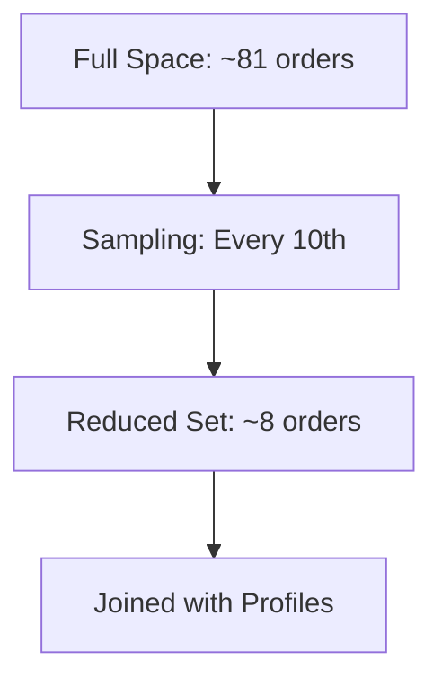

## 2. Password Strength Testing in Cybersecurity
**Use Case**: Generating constrained password combinations to test security policies.

Cybersecurity teams need to evaluate password policies for robustness. JNumberTools generates valid passwords under complex constraints, sampling massive combinatorial spaces efficiently.

**Example**: Generate every 100th password combination with 5 distinct lowercase letters, 3 distinct uppercase letters, and 2 special symbols (repetition allowed).

```java
import com.github.deepeshpatel.jnumbertools.base.JNumberTools;
import java.util.List;
import java.util.stream.IntStream;

public class PasswordTesting {
    public static void main(String[] args) {
        var smallAlphabets = IntStream.rangeClosed('a', 'z').mapToObj(c -> String.valueOf((char) c)).toList();
        var capitalAlphabets = IntStream.rangeClosed('A', 'Z').mapToObj(c -> String.valueOf((char) c)).toList();
        var symbols = List.of("~", "!", "@", "#");

        var passwords = JNumberTools.cartesianProduct()
            .constrainedProductOf(5, smallAlphabets) // 5 distinct lowercase
            .andDistinct(3, capitalAlphabets) // 3 distinct uppercase
            .and(2, symbols) // 2 symbols
            .lexOrderNth(0, 100) // Every 100th combination
            .stream()
            .toList();

        passwords.forEach(System.out::println);
    }
}
```

**Output (Sample)**:
```
[a, b, c, d, e, A, B, C, ~, !]
[a, b, c, d, f, A, B, D, @, #]
...
```

**Why It’s Powerful**: This code generates policy-compliant passwords, sampling every 100th combination to explore large spaces efficiently. In a Flink pipeline, passwords can be streamed to a strength analyzer, minimizing overhead.

**Impact**: Strengthens security by enabling thorough policy testing, protecting against cyber threats.

### Pipeline Visualization
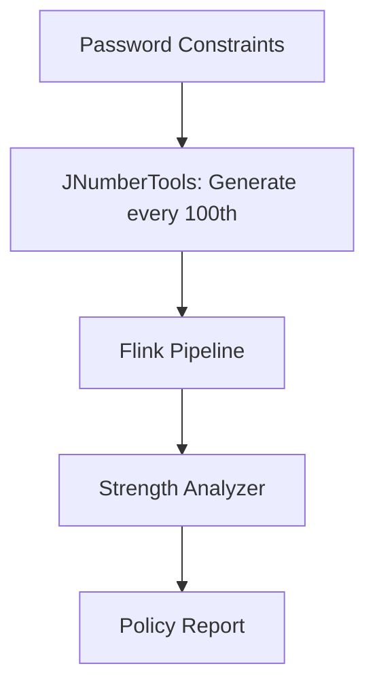

## 3. Product Bundle Optimization in E-Commerce
**Use Case**: Creating and testing product bundles to maximize customer appeal.

E-commerce platforms rely on product bundles to boost sales. JNumberTools simplifies generating valid combinations with constraints.

**Example**: Generate all valid laptop bundles with 1 laptop model, 2 distinct accessories, and 1–3 software subscriptions.

```java
import com.github.deepeshpatel.jnumbertools.base.JNumberTools;
import java.util.List;

public class ProductBundleOptimization {
    public static void main(String[] args) {
        var laptops = List.of("MacBook", "ThinkPad", "Surface");
        var accessories = List.of("Mouse", "Keyboard", "Headphones");
        var software = List.of("Office", "Antivirus", "IDE");

        var bundles = JNumberTools.cartesianProduct()
            .constrainedProductOf(1, laptops) // 1 laptop
            .andDistinct(2, accessories) // 2 distinct accessories
            .andInRange(1, 3, software) // 1–3 software subscriptions
            .lexOrder()
            .stream()
            .toList();

        bundles.forEach(System.out::println);
    }
}
```

**Output (Sample)**:
```
[MacBook, Mouse, Keyboard, Office]
[MacBook, Mouse, Headphones, Office, Antivirus]
[ThinkPad, Keyboard, Headphones, IDE]
...
```

**Why It’s Powerful**: JNumberTools generates realistic bundles, which can be filtered in a Snowflake pipeline based on inventory or preferences. Lexicographical ordering ensures comprehensive coverage for A/B testing.

**Impact**: Drives revenue by identifying high-value bundles efficiently.

### Sampling Visualization
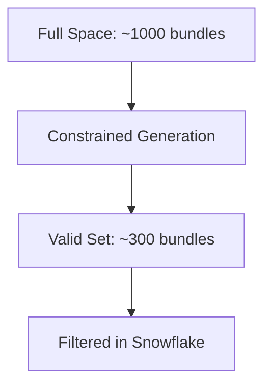

## 4. Filtering Combinatorial Data in Hadoop MapReduce Pipelines
**Use Case**: Generating and filtering valid combinations in a Hadoop MapReduce pipeline for scalable analytics.

Filtering relevant subsets from massive datasets is critical in big data pipelines. JNumberTools generates constrained combinations and samples them efficiently, integrating seamlessly with Hadoop’s MapReduce framework.

**Example**: Generate valid product bundles (1 laptop, 2 distinct accessories, 1–3 software subscriptions) and filter those with “Office” software and sufficient inventory, sampling every 100th combination.

### MapReduce Implementation
This assumes product data is in HDFS, with inventory data for filtering.

```java
import com.github.deepeshpatel.jnumbertools.base.JNumberTools;
import org.apache.hadoop.conf.Configuration;
import org.apache.hadoop.fs.Path;
import org.apache.hadoop.io.LongWritable;
import org.apache.hadoop.io.Text;
import org.apache.hadoop.mapreduce.Job;
import org.apache.hadoop.mapreduce.Mapper;
import org.apache.hadoop.mapreduce.Reducer;
import org.apache.hadoop.mapreduce.lib.input.FileInputFormat;
import org.apache.hadoop.mapreduce.lib.output.FileOutputFormat;
import java.io.IOException;
import java.util.List;

public class BundleFilterMapReduce {
    public static class BundleMapper extends Mapper<LongWritable, Text, Text, Text> {
        private final List<String> laptops = List.of("MacBook", "ThinkPad", "Surface");
        private final List<String> accessories = List.of("Mouse", "Keyboard", "Headphones");
        private final List<String> software = List.of("Office", "Antivirus", "IDE");

        @Override
        protected void map(LongWritable key, Text value, Context context)
                throws IOException, InterruptedException {
            var bundles = JNumberTools.cartesianProduct()
                .constrainedProductOf(1, laptops)
                .andDistinct(2, accessories)
                .andInRange(1, 3, software)
                .lexOrderNth(0, 100) // Every 100th combination
                .stream()
                .toList();

            for (var bundle : bundles) {
                context.write(new Text("bundle"), new Text(bundle.toString()));
            }
        }
    }

    public static class BundleReducer extends Reducer<Text, Text, Text, Text> {
        private final List<String> inStockSoftware = List.of("Office", "Antivirus");

        @Override
        protected void reduce(Text key, Iterable<Text> values, Context context)
                throws IOException, InterruptedException {
            for (Text bundle : values) {
                String bundleStr = bundle.toString();
                if (bundleStr.contains("Office") && inStockSoftware.stream().anyMatch(bundleStr::contains)) {
                    context.write(key, bundle);
                }
            }
        }
    }

    public static void main(String[] args) throws Exception {
        Configuration conf = new Configuration();
        Job job = Job.getInstance(conf, "BundleFilterMapReduce");
        job.setJarByClass(BundleFilterMapReduce.class);
        job.setMapperClass(BundleMapper.class);
        job.setReducerClass(BundleReducer.class);
        job.setOutputKeyClass(Text.class);
        job.setOutputValueClass(Text.class);
        FileInputFormat.addInputPath(job, new Path(args[0]));
        FileOutputFormat.setOutputPath(job, new Path(args[1]));
        System.exit(job.waitForCompletion(true) ? 0 : 1);
    }
}
```

**Output (Sample, written to HDFS)**:
```
bundle  [MacBook, Mouse, Keyboard, Office]
bundle  [MacBook, Mouse, Headphones, Office, Antivirus]
...
```

### Pipeline Visualization
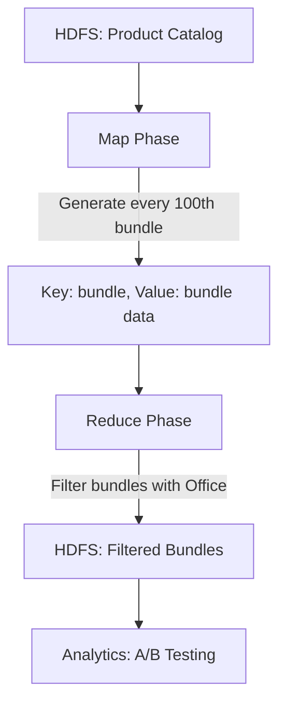

### Sampling Visualization
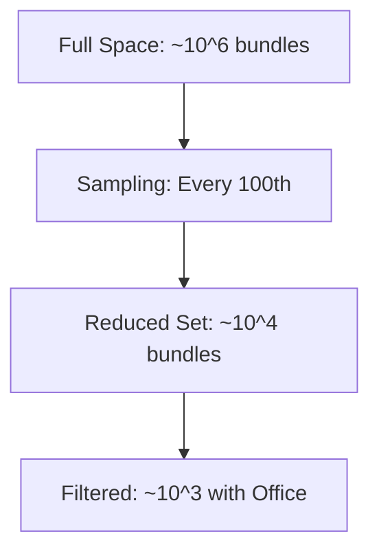

**Why It’s Powerful**: JNumberTools generates valid bundles efficiently, reducing data volume by 90% through sampling. Its stream-based API ensures Hadoop compatibility, making it production-ready for retail analytics.

**Impact**: Enables scalable, cost-effective analytics, driving business insights.

## 5. Bioinformatics: Sequence Analysis and Motif Generation
**Use Case**: Generating constrained DNA or protein sequences for bioinformatics research.

Bioinformatics researchers analyze DNA/protein sequences to identify motifs or generate synthetic sequences. JNumberTools generates valid sequences under constraints, sampling massive spaces efficiently.

**Example**: Generate every 100th valid DNA sequence of length 8–10, using {A, C, G, T}, with exactly 2 Cs, 2 Gs, and no consecutive Ts.

```java
import com.github.deepeshpatel.jnumbertools.base.JNumberTools;
import java.util.List;

public class DNAMotifGeneration {
    public static void main(String[] args) {
        var nucleotides = List.of("A", "C", "G", "T");

        var sequences = JNumberTools.combinations()
            .constrainedProductOf(2, nucleotides, "C") // 2 Cs
            .andDistinct(2, nucleotides, "G") // 2 Gs
            .andInRange(4, 6, nucleotides) // 4–6 others
            .withConstraint(s -> !s.contains("TT")) // No consecutive Ts
            .lexOrderNth(0, 100) // Every 100th sequence
            .stream()
            .toList();

        sequences.forEach(System.out::println);
    }
}
```

**Output (Sample)**:
```
[C, C, G, G, A, A, C, A]
[C, G, C, G, A, C, A, A]
...
```

**Why It’s Powerful**: JNumberTools enforces constraints like “no consecutive Ts” and samples sequences to reduce combinatorial spaces. In a Spark pipeline, sequences can be analyzed for motif discovery.

**Impact**: Accelerates genomics research by generating valid, diverse sequences efficiently.

### Sampling Visualization
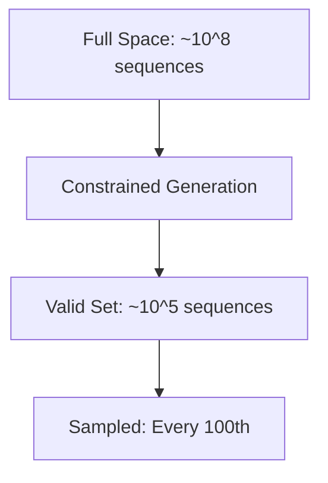

## 6. Logistics: Route and Schedule Optimization
**Use Case**: Generating constrained delivery routes or schedules for logistics optimization.

Logistics companies optimize routes or schedules under constraints (e.g., specific stops or time windows). JNumberTools generates valid combinations, sampling them for testing.

**Example**: Generate every 100th valid delivery route for a courier visiting 4 distinct cities from 8, with 1–2 rest stops.

```java
import com.github.deepeshpatel.jnumbertools.base.JNumberTools;
import java.util.List;

public class DeliveryRouteOptimization {
    public static void main(String[] args) {
        var cities = List.of("NY", "LA", "Chicago", "Houston", "Miami", "Seattle", "Boston", "Denver");
        var restStops = List.of("Park", "Cafe");

        var routes = JNumberTools.permutations()
            .ofDistinct(4, cities) // 4 distinct cities
            .andInRange(1, 2, restStops) // 1–2 rest stops
            .lexOrderNth(0, 100) // Every 100th route
            .stream()
            .toList();

        routes.forEach(System.out::println);
    }
}
```

**Output (Sample)**:
```
[NY, LA, Chicago, Houston, Park]
[LA, Miami, Seattle, Boston, Cafe]
...
```

**Why It’s Powerful**: JNumberTools generates valid routes with constraints, sampling every 100th to reduce computation. In a Spark pipeline, routes can be evaluated for cost or time efficiency.

**Impact**: Optimizes logistics operations, reducing costs and improving delivery times.

### Pipeline Visualization
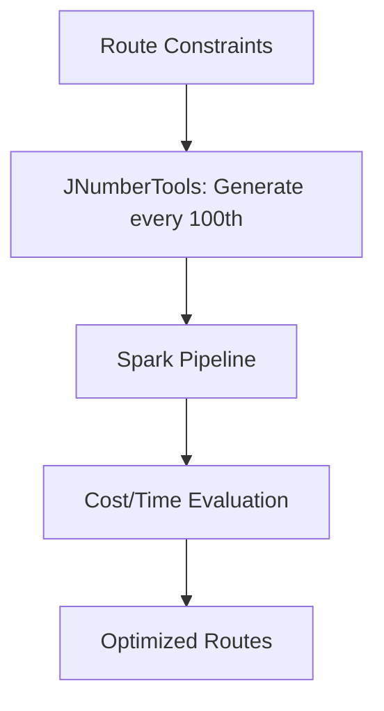

## 7. Network Analysis: Subgraph Generation
**Use Case**: Generating valid subgraphs for network analysis in social media or telecom.

Network analysis involves generating valid subgraphs (e.g., connected nodes) to study interactions. JNumberTools generates constrained combinations, sampling them efficiently.

**Example**: Generate every 100th valid subgraph with 3 distinct nodes and 1–2 edges from a telecom network.

```java
import com.github.deepeshpatel.jnumbertools.base.JNumberTools;
import java.util.List;

public class SubgraphGeneration {
    public static void main(String[] args) {
        var nodes = List.of("Node1", "Node2", "Node3", "Node4", "Node5");
        var edges = List.of("E1", "E2", "E3");

        var subgraphs = JNumberTools.combinations()
            .ofDistinct(3, nodes) // 3 distinct nodes
            .andInRange(1, 2, edges) // 1–2 edges
            .lexOrderNth(0, 100) // Every 100th subgraph
            .stream()
            .toList();

        subgraphs.forEach(System.out::println);
    }
}
```

**Output (Sample)**:
```
[Node1, Node2, Node3, E1]
[Node2, Node3, Node4, E1, E2]
...
```

**Why It’s Powerful**: JNumberTools generates valid subgraphs, sampling every 100th to explore large networks. In a Flink pipeline, subgraphs can be analyzed for connectivity or influence.

**Impact**: Enhances network analysis, enabling better insights into social or telecom interactions.

### Sampling Visualization
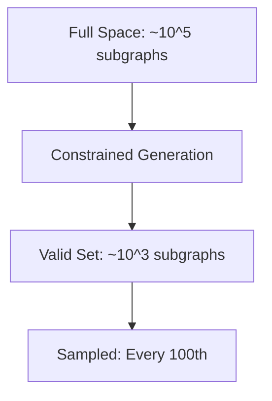

## 8. Test Case Generation for Combinatorial Software Testing
**Use Case**: Generating constrained test cases for combinatorial software testing.

Combinatorial testing ensures software handles all valid input combinations (e.g., browser, OS, device for a web app). JNumberTools generates constrained test cases and samples specific *n*-th cases to cover large input spaces efficiently.

**Example**: Generate every 100th valid test case for a web app with browsers, operating systems, and devices, ensuring compatibility constraints (e.g., Safari only on macOS/iOS).

```java
import com.github.deepeshpatel.jnumbertools.base.JNumberTools;
import java.util.List;

public class CombinatorialTesting {
    public static void main(String[] args) {
        var browsers = List.of("Chrome", "Firefox", "Safari", "Edge");
        var os = List.of("Windows", "macOS", "iOS", "Android");
        var devices = List.of("Desktop", "Tablet", "Phone");

        var testCases = JNumberTools.cartesianProduct()
            .constrainedProductOf(1, browsers)
            .and(1, os)
            .and(1, devices)
            .withConstraint(c -> !(c.contains("Safari") && !List.of("macOS", "iOS").contains(c.get(1)))) // Safari only on macOS/iOS
            .lexOrderNth(0, 100) // Every 100th test case
            .stream()
            .toList();

        testCases.forEach(System.out::println);
    }
}
```

**Output (Sample)**:
```
[Chrome, Windows, Desktop]
[Firefox, Android, Phone]
[Safari, macOS, Tablet]
...
```

**Why It’s Powerful**: JNumberTools enforces compatibility constraints and samples every 100th test case, reducing the test suite size while ensuring coverage. In a CI/CD pipeline with Jenkins or Spark, test cases can be distributed across nodes for parallel execution, leveraging JNumberTools’ stream-based API.

**Impact**: Accelerates software testing, ensuring robust coverage with minimal resources, critical for agile development.

### Pipeline Visualization
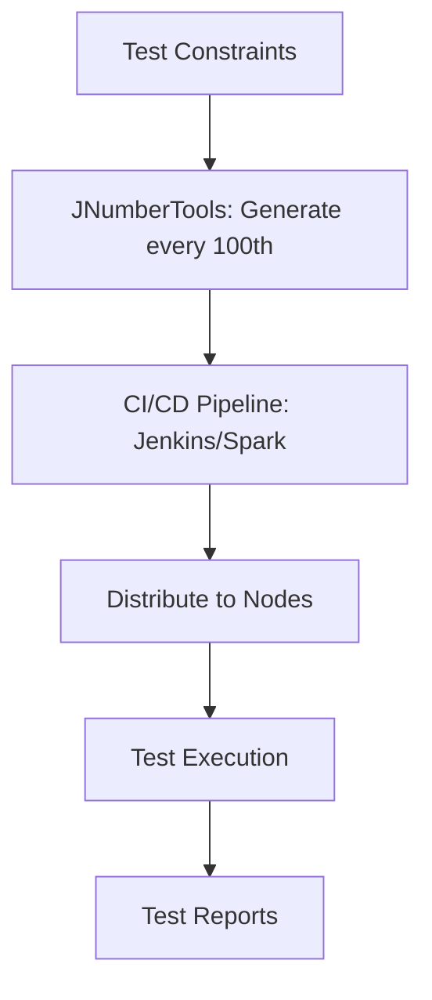

### Sampling Visualization
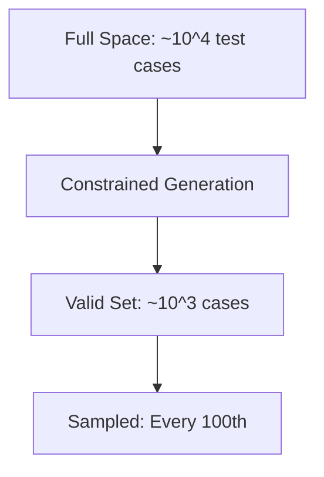

## 9. Experimental Design in Scientific Research
**Use Case**: Designing experiments with constrained combinations of conditions in scientific research.

Scientific experiments require testing combinations of conditions (e.g., drug dosages, temperatures) under constraints (e.g., maximum dosage limits). JNumberTools generates valid combinations and samples *n*-th elements for efficient experimental design.

**Example**: Generate every 50th valid experimental condition for a drug trial with 3 dosages, 4 temperatures, and 2 administration times, ensuring high dosages are only used at low temperatures.

```java
import com.github.deepeshpatel.jnumbertools.base.JNumberTools;
import java.util.List;

public class ExperimentalDesign {
    public static void main(String[] args) {
        var dosages = List.of("Low", "Medium", "High");
        var temperatures = List.of("20C", "25C", "30C", "35C");
        var times = List.of("Morning", "Evening");

        var conditions = JNumberTools.cartesianProduct()
            .constrainedProductOf(1, dosages)
            .and(1, temperatures)
            .and(1, times)
            .withConstraint(c -> !(c.contains("High") && !List.of("20C", "25C").contains(c.get(1)))) // High dosage only at 20C or 25C
            .lexOrderNth(0, 50) // Every 50th condition
            .stream()
            .toList();

        conditions.forEach(System.out::println);
    }
}
```

**Output (Sample)**:
```
[Low, 20C, Morning]
[Medium, 30C, Evening]
[High, 25C, Morning]
...
```

**Why It’s Powerful**: JNumberTools enforces constraints like dosage-temperature compatibility and samples every 50th condition, creating a manageable experiment plan. In a Spark pipeline, conditions can be analyzed with statistical tools, reducing lab costs.

**Impact**: Streamlines experimental planning, saving time and resources while ensuring valid designs.

### Flow Visualization
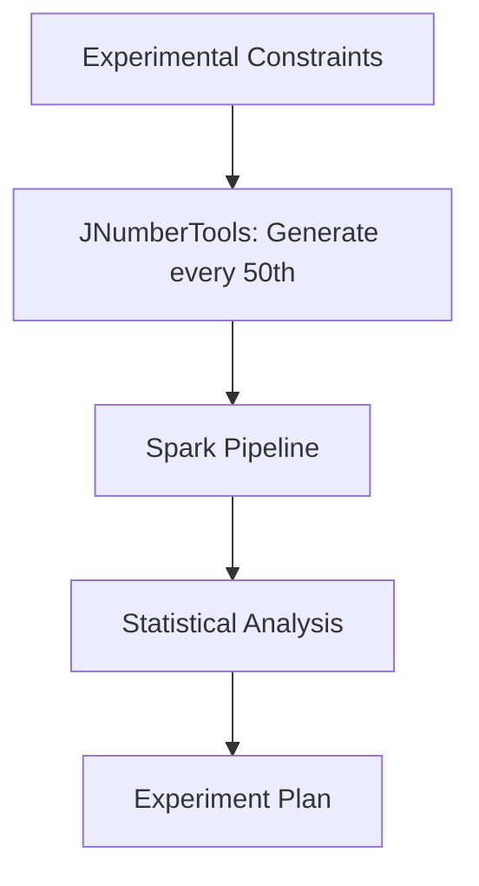

### Sampling Visualization
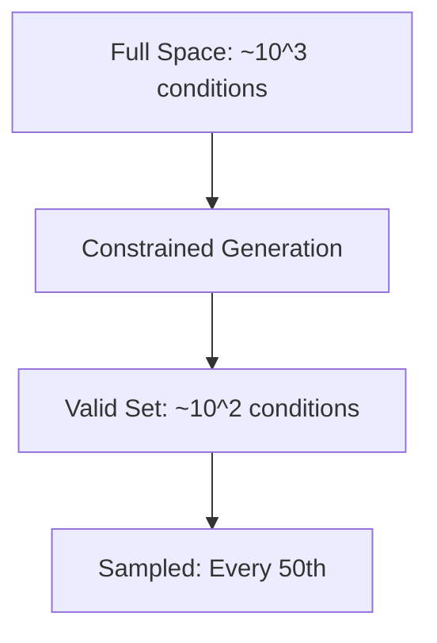

## 10. Cryptographic Key Space Exploration
**Use Case**: Exploring constrained cryptographic key spaces for cipher analysis or security auditing.

Cryptographic research requires generating constrained key sequences (e.g., fixed Hamming weight) to test algorithms. JNumberTools generates valid keys and samples *n*-th elements to explore large key spaces efficiently.

**Example**: Generate every 1000th 8-bit key with exactly 4 bits set to 1 (Hamming weight of 4) for testing a block cipher.

```java
import com.github.deepeshpatel.jnumbertools.base.JNumberTools;
import java.util.List;

public class KeySpaceExploration {
    public static void main(String[] args) {
        var bits = List.of("0", "1");

        var keys = JNumberTools.combinations()
            .constrainedProductOf(4, bits, "1") // Exactly 4 bits set to 1
            .and(4, bits, "0") // Exactly 4 bits set to 0
            .lexOrderNth(0, 1000) // Every 1000th key
            .stream()
            .toList();

        keys.forEach(System.out::println);
    }
}
```

**Output (Sample)**:
```
[1, 1, 1, 1, 0, 0, 0, 0]
[1, 1, 1, 0, 1, 0, 0, 0]
...
```

**Why It’s Powerful**: JNumberTools generates keys with precise constraints and samples every 1000th, enabling efficient exploration of massive key spaces. In a Flink pipeline, keys can be tested for cipher strength, leveraging factoradic indexing for accuracy.

**Impact**: Enhances cryptographic research and auditing, critical for developing secure systems.

### Pipeline Visualization
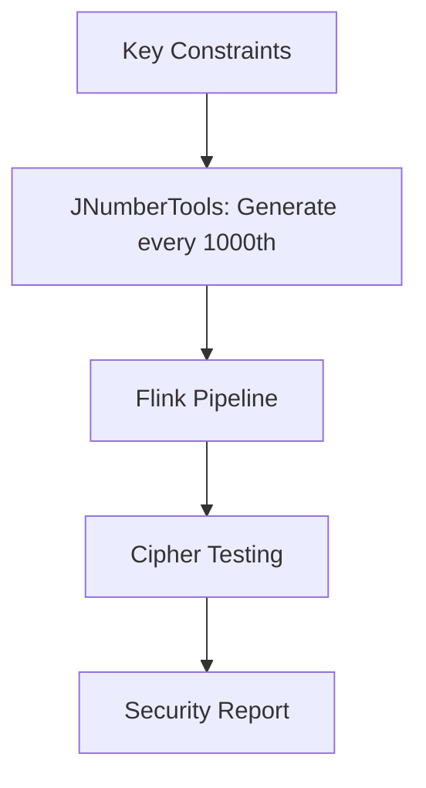

### Sampling Visualization
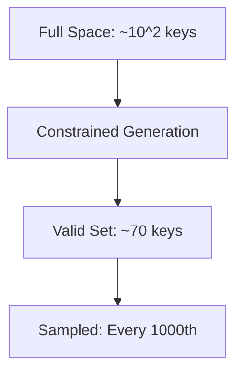

## Getting Started
1. **Install JNumberTools**:
   - Add JNumberTools to your project via Maven/Gradle (see the [main repository](https://github.com/deepeshpatel/JNumberTools)).
   - Clone this repository:
     ```bash
     git clone https://github.com/deepeshpatel/JNumberTools-examples-and-uses.git
     ```
2. **Run Examples**:
   - Copy the code snippets into your Java environment.
   - Explore additional examples as they’re added to this repository.

## Contributing
We welcome contributions! To add examples or improve this README:
1. Fork this repository.
2. Create a branch (`git checkout -b feature/new-example`).
3. Commit your changes (`git commit -m "Add example for X"`).
4. Push to your branch (`git push origin feature/new-example`).
5. Open a pull request.

## Links
- [JNumberTools Repository](https://github.com/deepeshpatel/JNumberTools)
- [LinkedIn](https://www.linkedin.com/in/deepesh-patel-india/)

## Tags
JNumberTools, Java library, combinatorics, permutations, combinations, Cartesian products, constrained generation, lexicographical sampling, big data pipelines, Apache Spark, Apache Flink, Hadoop, MapReduce, synthetic data, machine learning, cybersecurity, password testing, bioinformatics, logistics, software testing, experimental design, cryptography
